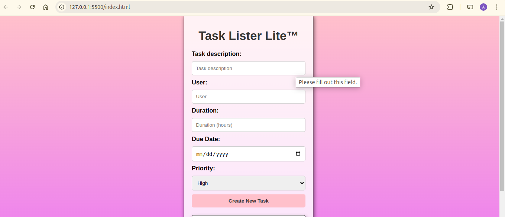

# TASKLISTER-MINI-PROJECT
*****
### Author: Andrew  Ambuka October 6th 2024
****
## Project Description
An app that allows one to create a to-do list and also organise them based on importance.
******

## SCREENSHOTS

********
## SetUp Instruction
### Requirements
* [HTML](html.com)
* [css](Framework URL)
* Text editor eg [Visual Studio Code](https://code.visualstudio.com/download)

### Getting Files
* Fork the repo
- Create a new branch in your terminal (git checkout -b improve-feature)
- Install the prerequisites
- Make appropriate changes in file(s)
- Run the server to see the changes
- Add the changes and commit them (git commit -am "Improve App")
- Push to the branch (git push origin improve-app)
- Create a Pull request
* Open the folder location on terminal and use the following command to run app:

## How To Run It
>  Clone repository

> Run using live server
*****

## Dependencies
- Google fonts
- Font awesome Icons
- Particles JS
*****
## Technologies Used
1. HTML
2. CSS
3. JavaScript
*****
## Contact Information
* Email : ambukaa93@gmail.com
*****
## [License](LICENSE)
MIT License
Copyright (c) 2024 Andrew Ambuka
